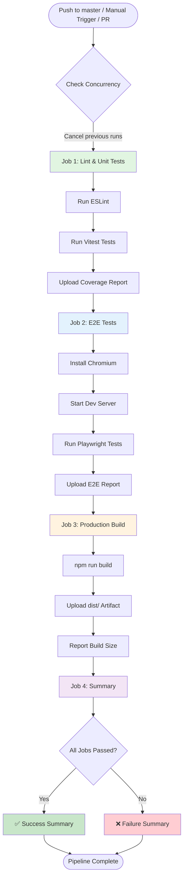
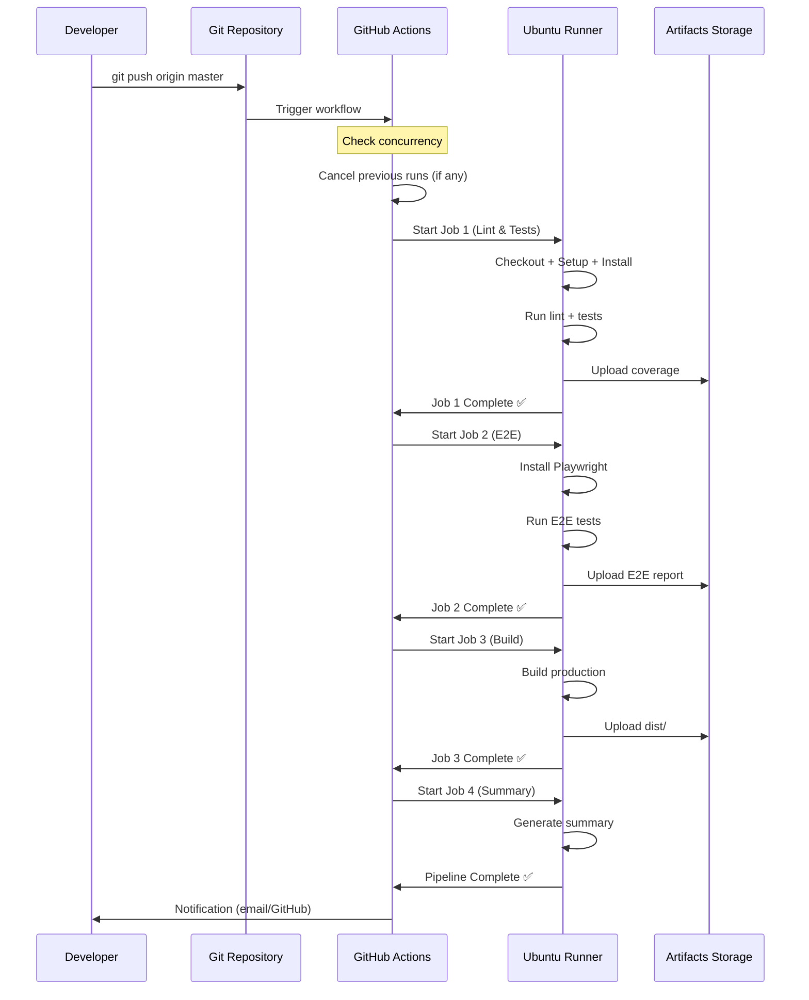
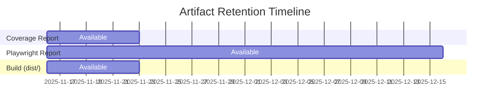

# CI/CD Architecture

## Pipeline Flow Diagram



## Detailed Job Architecture

### Job 1: Lint & Unit Tests

```
┌─────────────────────────────────────┐
│   Job: lint-and-test                │
│   Runner: ubuntu-latest             │
│   Timeout: default (6h)             │
└─────────────────────────────────────┘
           │
           ├─► Checkout code (v4)
           │
           ├─► Setup Node.js
           │   ├─ Version: from .nvmrc (22.14.0)
           │   └─ Cache: npm
           │
           ├─► Install dependencies
           │   └─ npm ci (clean install)
           │
           ├─► Run ESLint
           │   └─ npm run lint
           │
           ├─► Run unit tests
           │   └─ npm run test (Vitest)
           │
           └─► Upload coverage (if exists)
               ├─ Path: coverage/
               ├─ Retention: 7 days
               └─ Condition: always()
```

### Job 2: E2E Tests

```
┌─────────────────────────────────────┐
│   Job: e2e-tests                    │
│   Runner: ubuntu-latest             │
│   Timeout: 60 minutes               │
│   Depends: lint-and-test            │
└─────────────────────────────────────┘
           │
           ├─► Checkout code (v4)
           │
           ├─► Setup Node.js
           │   ├─ Version: from .nvmrc
           │   └─ Cache: npm
           │
           ├─► Install dependencies
           │   └─ npm ci
           │
           ├─► Install Playwright browsers
           │   └─ npx playwright install --with-deps chromium
           │       (Only Chromium for speed)
           │
           ├─► Run Playwright tests
           │   ├─ npm run test:e2e
           │   ├─ Dev server starts automatically
           │   └─ ENV: CI=true
           │
           └─► Upload Playwright report
               ├─ Path: playwright-report/
               ├─ Retention: 30 days
               └─ Condition: always()
```

### Job 3: Production Build

```
┌─────────────────────────────────────┐
│   Job: build                        │
│   Runner: ubuntu-latest             │
│   Timeout: default (6h)             │
│   Depends: [lint-and-test, e2e]    │
└─────────────────────────────────────┘
           │
           ├─► Checkout code (v4)
           │
           ├─► Setup Node.js
           │   ├─ Version: from .nvmrc
           │   └─ Cache: npm
           │
           ├─► Install dependencies
           │   └─ npm ci
           │
           ├─► Build for production
           │   ├─ npm run build
           │   └─ ENV: NODE_ENV=production
           │
           ├─► Upload build artifacts
           │   ├─ Path: dist/
           │   └─ Retention: 7 days
           │
           └─► Check build size
               └─ Report to GitHub Summary
```

### Job 4: Summary

```
┌─────────────────────────────────────┐
│   Job: summary                      │
│   Runner: ubuntu-latest             │
│   Timeout: default (6h)             │
│   Depends: [all previous jobs]     │
│   Condition: always()               │
└─────────────────────────────────────┘
           │
           └─► Check pipeline status
               ├─ Generate Markdown table
               ├─ Show status of each job
               ├─ Write to GitHub Summary
               └─ Exit with appropriate code
                   ├─ 0 if all passed
                   └─ 1 if any failed
```

## Trigger Flow



## Cache Strategy

```
┌─────────────────────────────────────┐
│   Cache Layer: npm                  │
└─────────────────────────────────────┘
           │
           ├─► Key: ${{ runner.os }}-node-${{ hashFiles('**/package-lock.json') }}
           │
           ├─► Restore from cache
           │   └─ If cache hit: Skip npm ci download
           │
           └─► Save to cache
               └─ After npm ci completes
```

**Benefits:**
- Reduces npm ci time from ~2-3 min to ~30 sec
- Shared across all jobs in the workflow
- Automatically invalidated when package-lock.json changes

## Concurrency Control

```
┌─────────────────────────────────────┐
│   Concurrency Group                 │
│   ${{ github.workflow }}-${{ ref }} │
└─────────────────────────────────────┘
           │
           ├─► Example: ci-cd-refs/heads/master
           │
           └─► Behavior: cancel-in-progress: true
               │
               ├─ New push arrives
               ├─ Check if workflow is running for same ref
               ├─ If yes: Cancel old run
               └─ Start new run
```

**Scenarios:**

| Scenario | Old Run | New Run |
|----------|---------|---------|
| Push #1 to master | Running | - |
| Push #2 to master (30s later) | ❌ Cancelled | ✅ Started |
| Push to feature branch | Running | Running (different ref) |

## Artifact Lifecycle



**Storage Limits:**
- Free tier: 500 MB storage
- Coverage: ~5-10 MB per run
- Playwright: ~20-50 MB per run
- Build: ~10-20 MB per run

**Estimated runs before limit:** ~10-15 runs (depending on sizes)

## Performance Metrics

### Expected Timings

| Job | Cold Run | Warm Run (cached) |
|-----|----------|-------------------|
| Lint & Unit Tests | 3-4 min | 2-3 min |
| E2E Tests | 8-10 min | 6-8 min |
| Production Build | 4-5 min | 3-4 min |
| Summary | <30 sec | <30 sec |
| **Total** | **15-20 min** | **11-15 min** |

### Optimization Impact

| Optimization | Time Saved | Implementation |
|--------------|------------|----------------|
| npm cache | ~1-2 min/job | `cache: 'npm'` |
| Chromium only | ~2-3 min | `--with-deps chromium` |
| Concurrency control | Varies | Cancel old runs |
| Job dependencies | N/A | Sequential execution |

## Security Considerations

### Secrets Management

```yaml
# Example for future use
env:
  SUPABASE_URL: ${{ secrets.SUPABASE_URL }}
  SUPABASE_ANON_KEY: ${{ secrets.SUPABASE_ANON_KEY }}
  OPENROUTER_API_KEY: ${{ secrets.OPENROUTER_API_KEY }}
```

**Best Practices:**
- ✅ Never commit secrets to code
- ✅ Use GitHub Secrets for sensitive data
- ✅ Rotate secrets regularly
- ✅ Use environment-specific secrets
- ✅ Limit secret access to necessary jobs

### Permissions

Current workflow uses default permissions:
- `contents: read` - Read repository contents
- `actions: write` - Upload artifacts

Future considerations:
- `pull-requests: write` - Comment on PRs
- `deployments: write` - Deploy to environments

## Monitoring & Observability

### GitHub Actions Insights

Available metrics:
- ✅ Workflow run duration
- ✅ Job success/failure rates
- ✅ Artifact storage usage
- ✅ Cache hit rates
- ✅ Runner usage (minutes)

### Custom Metrics

Pipeline generates:
- Build size report
- Test coverage percentage
- E2E test results
- Lint error count

## Scalability

### Current Capacity

- **Concurrent jobs:** 20 (Free tier)
- **Job timeout:** 6 hours (default), 60 min (E2E)
- **Workflow timeout:** 72 hours
- **Storage:** 500 MB (artifacts)

### Future Scaling Options

1. **Matrix Strategy**
```yaml
strategy:
  matrix:
    node-version: [20.x, 22.x]
    os: [ubuntu-latest, windows-latest]
```

2. **Parallel E2E Tests**
```yaml
strategy:
  matrix:
    shard: [1, 2, 3, 4]
```

3. **Self-hosted Runners**
- Faster execution
- Custom hardware
- No minute limits

## Disaster Recovery

### Rollback Strategy

1. **Workflow fails:** Previous version in git history
2. **Bad deployment:** Revert commit + re-run
3. **Corrupted artifacts:** Re-run workflow
4. **Runner issues:** GitHub auto-retries

### Backup Plan

- Old workflows kept as DEPRECATED (manual trigger only)
- Can be re-enabled in emergency
- Git history preserves all versions

## Integration Points

### Current Integrations

- ✅ GitHub Actions
- ✅ npm (package management)
- ✅ Playwright (E2E testing)
- ✅ Vitest (unit testing)
- ✅ ESLint (linting)

### Future Integrations

- 🔄 Vercel/Netlify (deployment)
- 🔄 Slack/Discord (notifications)
- 🔄 Codecov (coverage reporting)
- 🔄 Sentry (error tracking)
- 🔄 Lighthouse CI (performance)

---

**Version:** 1.0.0  
**Last Updated:** 2025-11-16  
**Maintained by:** DevOps Team

