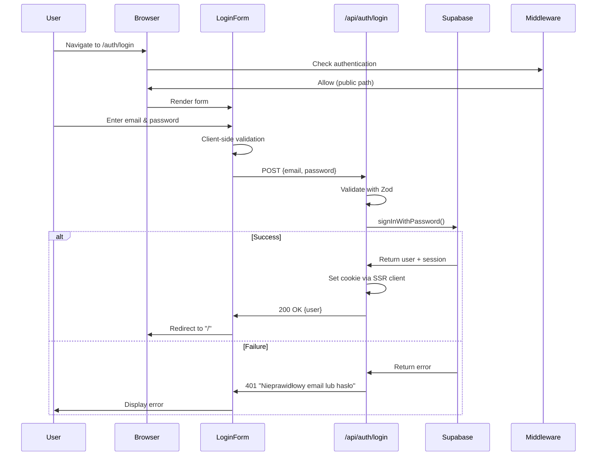
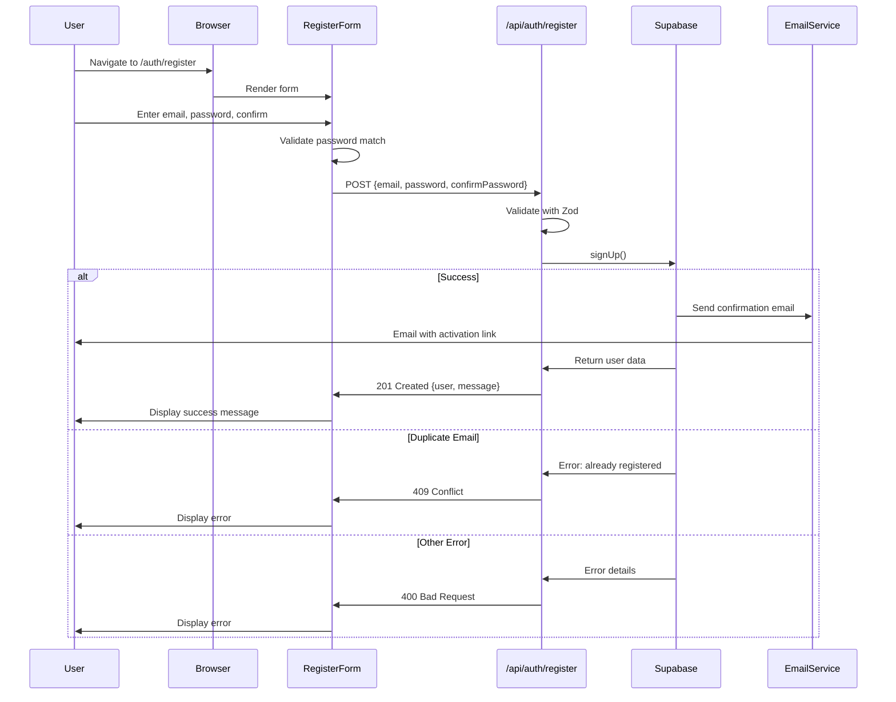
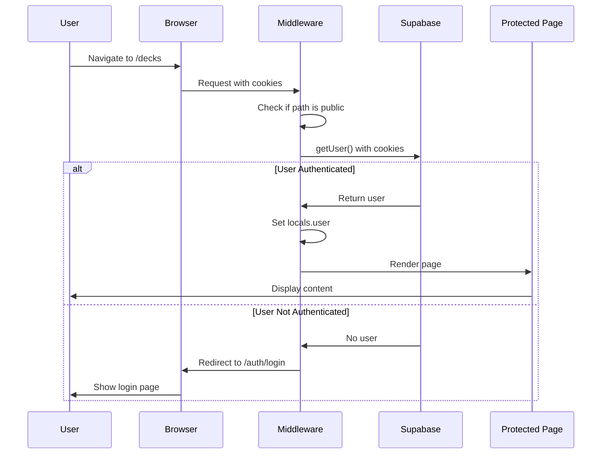
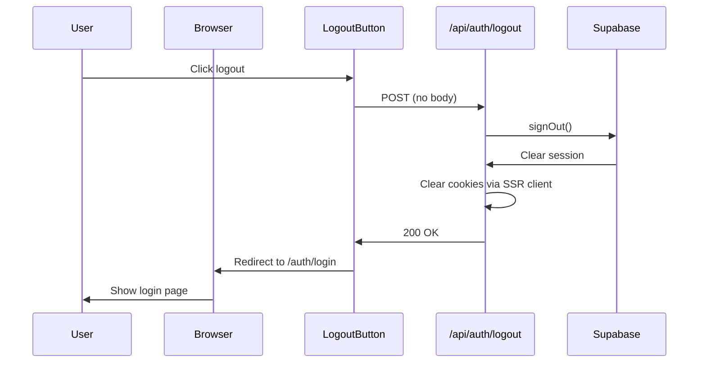
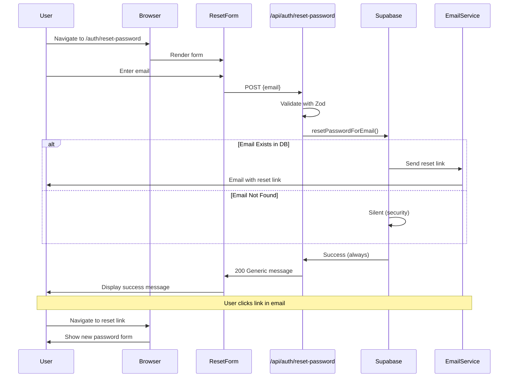
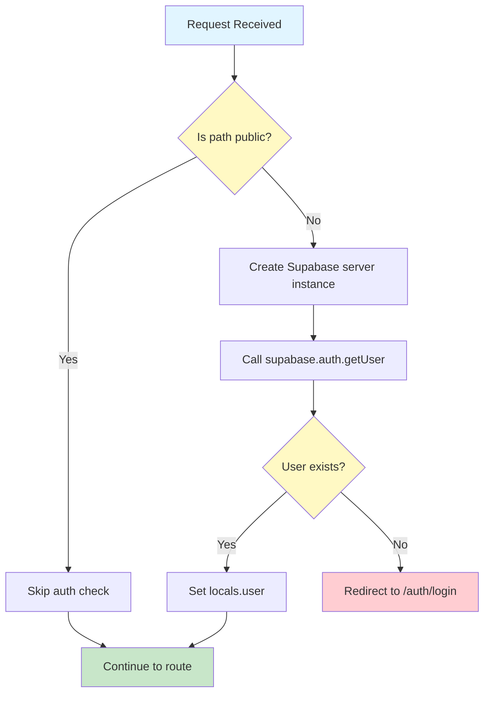
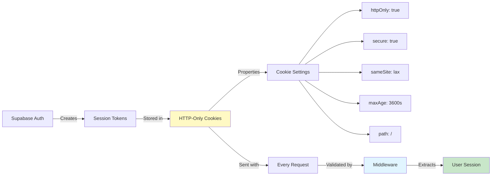
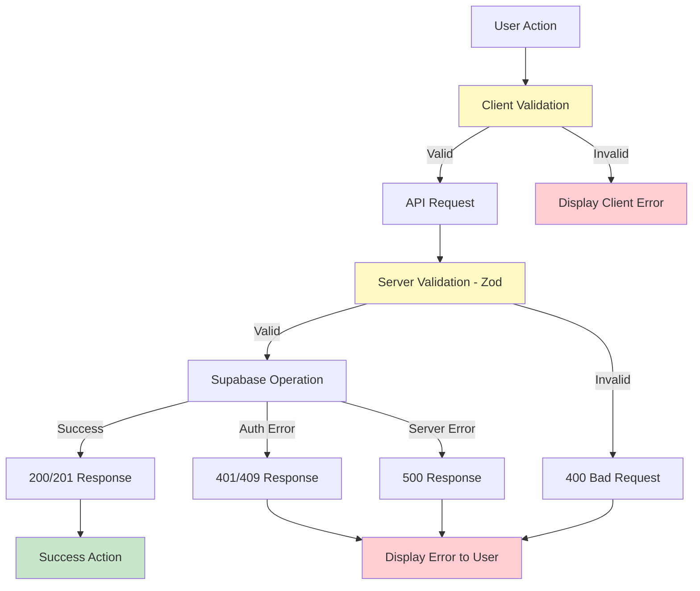

# Authentication Implementation Flow Diagram

## 1. Login Flow



---

## 2. Registration Flow



---

## 3. Protected Route Access Flow



---

## 4. Logout Flow



---

## 5. Password Reset Flow



---

## 6. Middleware Authentication Check Flow



---

## 7. Session Cookie Management



---

## 8. Component Integration Architecture

```mermaid
graph TB
    subgraph "Client Side - React"
        A[LoginForm.tsx]
        B[RegisterForm.tsx]
        C[ResetPasswordForm.tsx]
    end
    
    subgraph "Server Side - Astro Pages"
        D[login.astro]
        E[register.astro]
        F[reset-password.astro]
    end
    
    subgraph "API Endpoints"
        G[/api/auth/login.ts]
        H[/api/auth/register.ts]
        I[/api/auth/logout.ts]
        J[/api/auth/reset-password.ts]
    end
    
    subgraph "Supabase Client"
        K[createSupabaseServerInstance]
        L[Cookie Handlers]
    end
    
    D -->|renders| A
    E -->|renders| B
    F -->|renders| C
    
    A -->|fetch| G
    B -->|fetch| H
    C -->|fetch| J
    
    G --> K
    H --> K
    I --> K
    J --> K
    
    K --> L
    
    style A fill:#e1bee7
    style B fill:#e1bee7
    style C fill:#e1bee7
    style K fill:#fff9c4
```

---

## 9. Error Handling Flow



---

## 10. Data Flow Summary

```
┌─────────────────────────────────────────────────────────────────┐
│                         USER ACTIONS                              │
├─────────────────────────────────────────────────────────────────┤
│  Register  │  Login  │  Logout  │  Reset Password  │  Access App │
└─────┬──────┴────┬────┴────┬─────┴────────┬─────────┴──────┬──────┘
      │           │         │              │                │
      ▼           ▼         ▼              ▼                ▼
┌──────────────────────────────────────────────────────────────────┐
│                    REACT COMPONENTS                               │
│  RegisterForm  LoginForm  LogoutButton  ResetPasswordForm         │
└──────────────────────┬───────────────────────────────────────────┘
                       │
                       │ fetch()
                       ▼
┌──────────────────────────────────────────────────────────────────┐
│                     API ENDPOINTS                                 │
│  /api/auth/register   /api/auth/login   /api/auth/logout         │
│  /api/auth/reset-password                                         │
└──────────────────────┬───────────────────────────────────────────┘
                       │
                       │ createSupabaseServerInstance()
                       ▼
┌──────────────────────────────────────────────────────────────────┐
│                 SUPABASE SSR CLIENT                               │
│  - Cookie Management (getAll/setAll)                              │
│  - Session Handling                                               │
└──────────────────────┬───────────────────────────────────────────┘
                       │
                       │ HTTP Requests
                       ▼
┌──────────────────────────────────────────────────────────────────┐
│                   SUPABASE AUTH                                   │
│  - User Management                                                │
│  - Session Tokens                                                 │
│  - Email Verification                                             │
└──────────────────────┬───────────────────────────────────────────┘
                       │
                       │ Session Cookies
                       ▼
┌──────────────────────────────────────────────────────────────────┐
│                     MIDDLEWARE                                    │
│  - Validate Session                                               │
│  - Set locals.user                                                │
│  - Route Protection                                               │
└──────────────────────┬───────────────────────────────────────────┘
                       │
                       ▼
┌──────────────────────────────────────────────────────────────────┐
│                  PROTECTED ROUTES                                 │
│  /decks/*    /api/decks/*    All User Content                     │
└──────────────────────────────────────────────────────────────────┘
```

---

## Key Technical Decisions

### 1. **Why SSR Client?**
- Proper cookie management for server-side rendering
- Secure session handling without exposing tokens
- Seamless integration with Astro middleware

### 2. **Why Generic Error Messages?**
- Security: Don't reveal if email exists in database
- Prevents user enumeration attacks
- Industry best practice

### 3. **Why 1-Hour Session?**
- Balance between security and user experience
- Can be extended with refresh token logic in future
- Reduces risk of session hijacking

### 4. **Why Middleware Protection?**
- Centralized authentication logic
- DRY principle - no need to check auth in each page
- Automatic redirect for unauthenticated users

---

## Next Implementation: Logout Button in Layout

To complete the authentication flow, add a logout button to `Layout.astro`:

```astro
---
// src/layouts/Layout.astro
const { user } = Astro.locals;
---

<header>
  {user ? (
    <button id="logout-btn">Wyloguj się</button>
  ) : (
    <a href="/auth/login">Zaloguj się</a>
  )}
</header>

<script>
  document.getElementById('logout-btn')?.addEventListener('click', async () => {
    await fetch('/api/auth/logout', { method: 'POST' });
    window.location.href = '/auth/login';
  });
</script>
```

