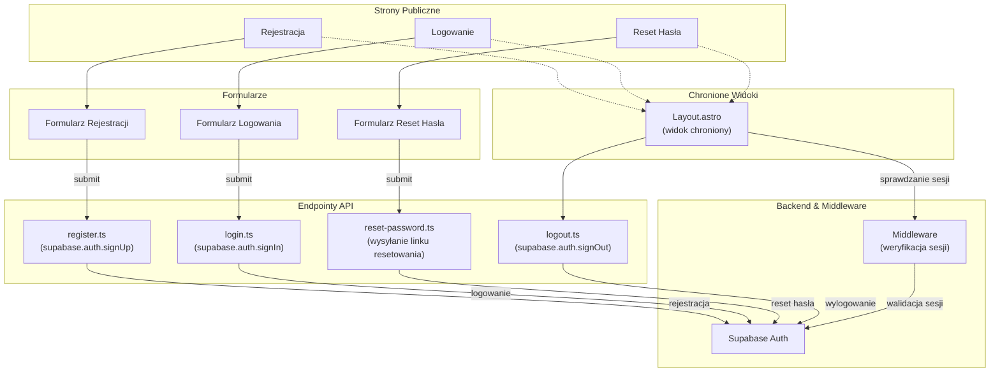

<architecture_analysis>
Składniki:
- Strony Publiczne: Rejestracja, Logowanie, Reset Hasła
- Formularze: Formularz Rejestracji, Formularz Logowania, Formularz Reset Hasła
- Endpointy API: register.ts (supabase.auth.signUp), login.ts (supabase.auth.signIn), logout.ts (supabase.auth.signOut), reset-password.ts (wysyłanie linku resetowania)
- Backend & Middleware: Middleware (weryfikacja sesji) oraz Supabase Auth jako centralny mechanizm.
- Chronione Widoki: Layout.astro (widok dostępny tylko po zalogowaniu)

Przepływ:
1. Użytkownik wchodzi na stronę rejestracji lub logowania i wypełnia formularz.
2. Formularz wysyła dane do odpowiedniego endpointu API.
3. Endpoint wykonuje operację na Supabase Auth i zwraca odpowiedź o statusie uwierzytelnienia.
4. W chronionych widokach Middleware sprawdza sesję i, w razie braku autoryzacji, przekierowuje użytkownika do strony logowania.
</architecture_analysis>

<mermaid_diagram>

</mermaid_diagram>
