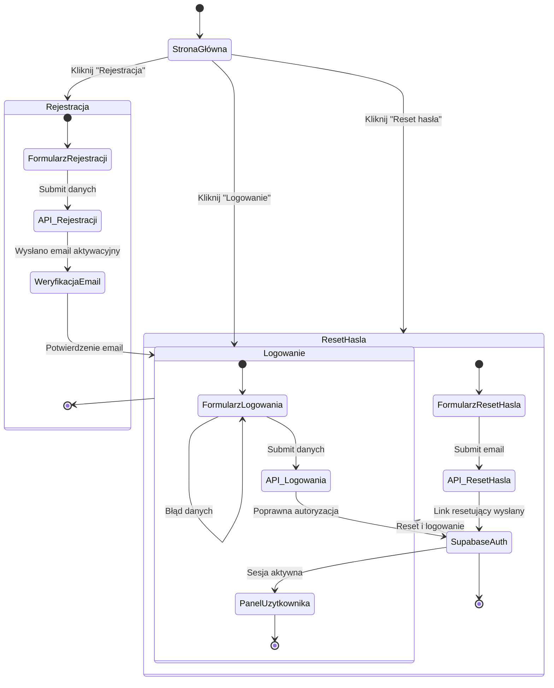

```mermaid
stateDiagram-v2
    [*] --> StronaGłówna

    %% Strona Główna z opcjami autoryzacji
    StronaGłówna --> Rejestracja: Kliknij "Rejestracja"
    StronaGłówna --> Logowanie: Kliknij "Logowanie"
    StronaGłówna --> ResetHasla: Kliknij "Reset hasła"

    %% Proces Rejestracji
    state Rejestracja {
        [*] --> FormularzRejestracji
        FormularzRejestracji --> API_Rejestracji: Submit danych
        API_Rejestracji --> WeryfikacjaEmail: Wysłano email aktywacyjny
        WeryfikacjaEmail --> Logowanie: Potwierdzenie email
        Logowanie --> [*]
    }

    %% Proces Logowania
    state Logowanie {
        [*] --> FormularzLogowania
        FormularzLogowania --> API_Logowania: Submit danych
        API_Logowania --> SupabaseAuth: Poprawna autoryzacja
        SupabaseAuth --> PanelUzytkownika: Sesja aktywna
        %% Punkt decyzyjny: niepoprawne dane prowadzą do błędu
        FormularzLogowania --> FormularzLogowania: Błąd danych
        PanelUzytkownika --> [*]
    }

    %% Proces Resetowania Hasła
    state ResetHasla {
        [*] --> FormularzResetHasla
        FormularzResetHasla --> API_ResetHasla: Submit email
        API_ResetHasla --> SupabaseAuth: Link resetujący wysłany
        %% Ścieżka po resecie może się zakończyć lub powrócić do logowania
        SupabaseAuth --> Logowanie: Reset i logowanie
        SupabaseAuth --> [*]
    }
```
