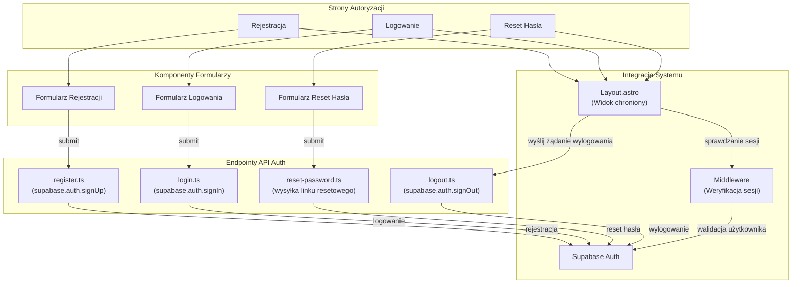

<architecture_analysis>
Komponenty:
- Strony autoryzacji: Rejestracja, Logowanie, Reset Hasła
- Komponenty formularzy: Formularz Rejestracji, Formularz Logowania, Formularz Reset Hasła
- Endpointy API: register.ts (supabase.auth.signUp), login.ts (supabase.auth.signIn), logout.ts (supabase.auth.signOut), reset-password.ts (wysyłka linku resetowego)
- Layout chroniony (Layout.astro) prezentuje widok użytkownika po zalogowaniu
- Middleware sprawdza sesję i przekierowuje niezalogowanych użytkowników do logowania
- Integracja z Supabase Auth umożliwia operacje rejestracji, logowania, wylogowania oraz resetowania hasła
</architecture_analysis>
<mermaid_diagram>

</mermaid_diagram>
